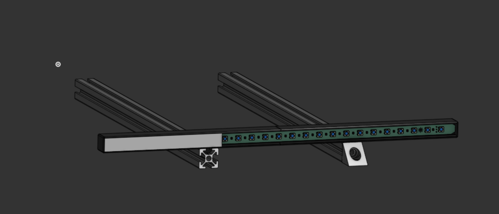

# H2Dont

## BOM

+ 2x M3 Heatset
+ 2x M3x8 Screws
+ 1x M3x10 Screw
+ Daylight Disco XXL

___

You will need to print 3x of the same diffuser stl. The long 370mm monolith has been split into 3.

___

<a href="https://github.com/Suzu0071">H2Dont</a> © 2025 by <a href="https://github.com/Suzu0071/H2Dont">Suzu0071</a> is licensed under <a href="https://creativecommons.org/licenses/by-nc-sa/4.0/">CC BY-NC-SA 4.0</a>